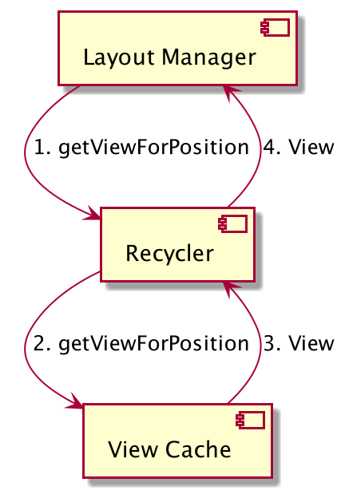
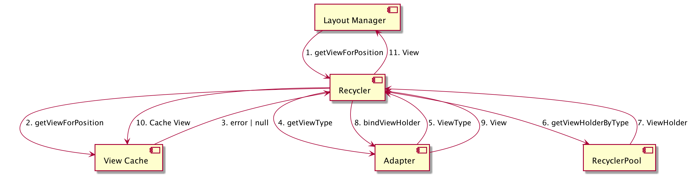
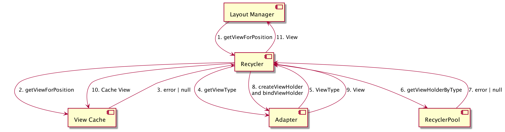

# Recycler View Internals - Create your own Recycler View

Recycler view is one of the major UI component of Android Ecosystem, and Most popular resource to learn it from
is [RecyclerView ins and outs - Google I/O 2016](https://www.youtube.com/watch?v=LqBlYJTfLP4&t=1797s)

This Video explains Recycler view Completely with lots of inside detail, but IMO there is hardly and code present in the
video which could help to relate what diagrams depicts in the video. so I have decided to create supplimentary content
by write Recycler View implementation as discussed in the video. You can use it to understand recycler view internals or
to ace your next technical interview.

So, help yourself and have a snack on the Code and as Always Happy Hacking!
Chetan Gupta.

**Note : I plan to covered only the things that are covered in video and did my own slight improvements to connect
things together where content isn't discussed in the Video, I won't be going far and behond the video so please don't
open unrelated issues or discussion in these.**

## Topics Covered

- [x] Birth Of View-Holder
- [ ] Adding View to UI
- [ ] Death of Recycler View
- [ ] Animation on RecyclerView Operation

# Birth Of View-Holder

### Component interaction Diagram - View Cache Pass

### Component interaction Diagram - View Cache Miss - Recycler Poll - Pass

### Component interaction Diagram - View Cache Miss - Recycler Poll - Miss

## :eyes: Social

[LinkedIn](https://bit.ly/ch8n-linkdIn) |
[Medium](https://bit.ly/ch8n-medium-blog) |
[Twitter](https://bit.ly/ch8n-twitter) |
[StackOverflow](https://bit.ly/ch8n-stackOflow) |
[CodeWars](https://bit.ly/ch8n-codewar) |
[Portfolio](https://bit.ly/ch8n-home) |
[Github](https://bit.ly/ch8n-git) |
[Instagram](https://bit.ly/ch8n-insta) |
[Youtube](https://bit.ly/ch8n-youtube)

## :cop: License

Shield: [![CC BY-SA 4.0][cc-by-sa-shield]][cc-by-sa]

This work is a licensed under a
[Creative Commons Attribution-ShareAlike 4.0 International License][cc-by-sa].

[![CC BY-SA 4.0][cc-by-sa-image]][cc-by-sa]

[cc-by-sa]: http://creativecommons.org/licenses/by-sa/4.0/

[cc-by-sa-image]: https://licensebuttons.net/l/by-sa/4.0/88x31.png

[cc-by-sa-shield]: https://img.shields.io/badge/License-CC%20BY--SA%204.0-lightgrey.svg
